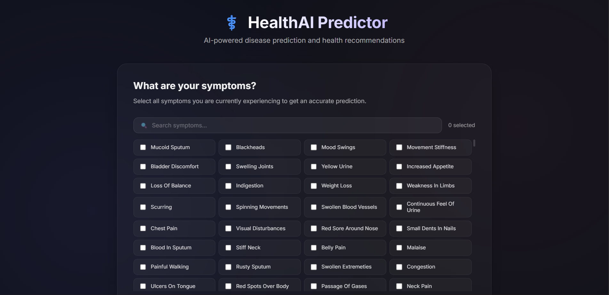
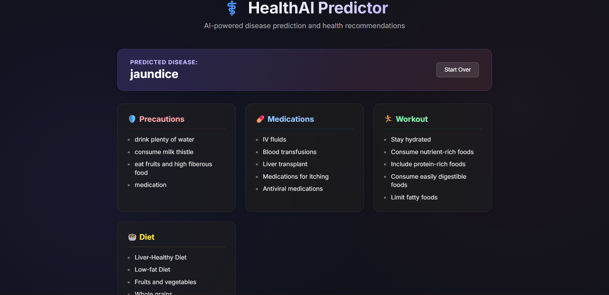

# 🏥 Personalized Healthcare Recommendation System

A full-stack healthcare recommendation system that predicts diseases based on user-selected symptoms and provides personalized healthcare recommendations using Machine Learning.

## 🚀 Features

* 🔐 User Authentication (Login & Signup)
* 🤖 Machine Learning-based Disease Prediction
* 🩺 Symptom Selection Interface
* 📋 Personalized Health Recommendations
* 💊 Precaution and Treatment Suggestions
* 📱 Responsive User Interface
* 🌐 RESTful API Integration

---

## 🛠️ Tech Stack

### Frontend

* React.js
* Vite
* CSS Modules
* Axios

### Backend

* Node.js
* Express.js
* Python
* Flask (ML Service)

### Database

* MongoDB

### Machine Learning

* Scikit-learn
* Pandas
* NumPy
* Pickle

---

## 📂 Project Structure

```
Personalised-Healthcare-Recommendation-System/
│
├── frontend/
│   ├── src/
│   ├── public/
│   └── package.json
│
├── backend/
│   ├── routes/
│   ├── controllers/
│   ├── models/
│   ├── ml_models/
│   └── package.json
│
└── README.md
```

---

## ⚙️ Installation

### Clone the repository

```bash
git clone https://github.com/pushkardubey997/Personalised-Healthcare-Recommendation-System.git
```

### Backend Setup

```bash
cd backend
npm install
```

### Frontend Setup

```bash
cd frontend
npm install
npm run dev
```

---

## 🤖 Machine Learning Model

The trained model (`model.pkl`) is intentionally not included in this repository because it exceeds GitHub's file size limit.

To run the project successfully:

* Train the model using the provided training script, or
* Place the generated `model.pkl` file inside:

```
backend/ml_models/
```

---

## 📸 Screenshots


| Home Page                 | Disease Prediction              |
| ------------------------- | ------------------------------- |
|  |  |

---

## 🌟 Future Improvements

* AI-powered chatbot
* Doctor Appointment Booking
* Medicine Recommendation
* Nearby Hospitals Integration
* Medical Report Upload
* Health Analytics Dashboard

---

## 👨‍💻 Author

**Pushkar Dubey**

GitHub: https://github.com/pushkardubey997

LinkedIn: *https://www.linkedin.com/in/pushkar-dubey-44938a406*

---

## ⭐ Support

If you found this project helpful, please consider giving it a ⭐ on GitHub.
